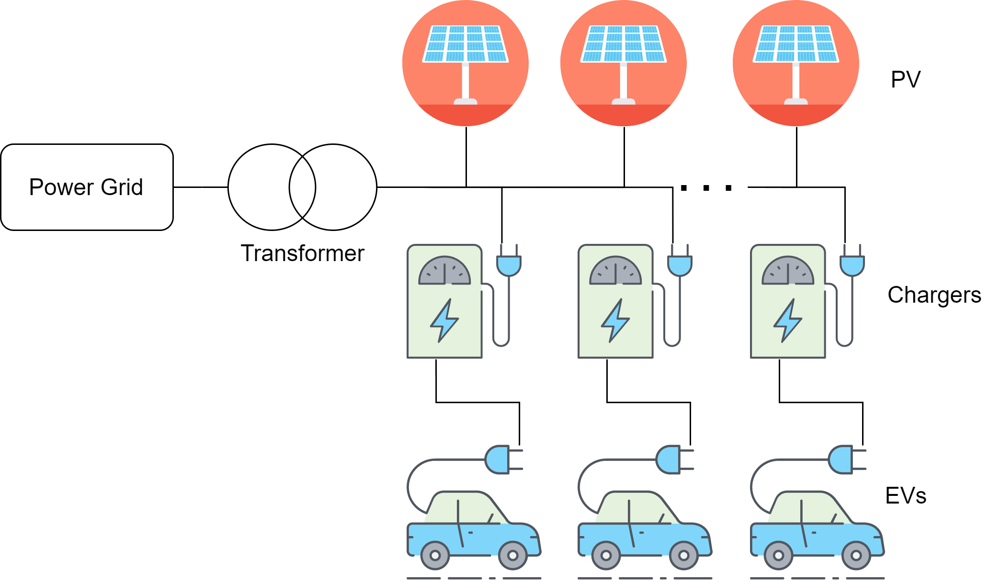

# Electric ParkingLot Simulator
Simulator for a parkinglot with EV chargers, PV generation and a transformer.
This simulator was made as part of a project for the DEMS course at University of Twente.

## Usage
Before running a simulation, add files with input data for the EVs and PV generation.

Run the file "scenarios.m" in Matlab. This will perform a simulation (sweep) with the given parameters.
The parameters should be altered directly in the code. The most important ones are near the top of "simulator.m".